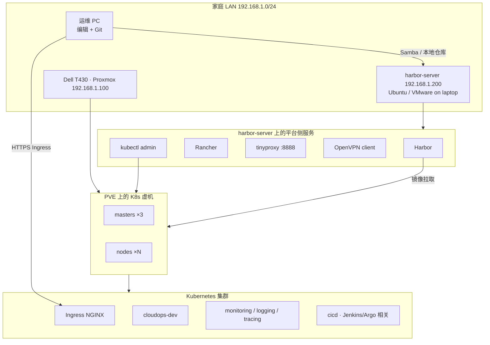
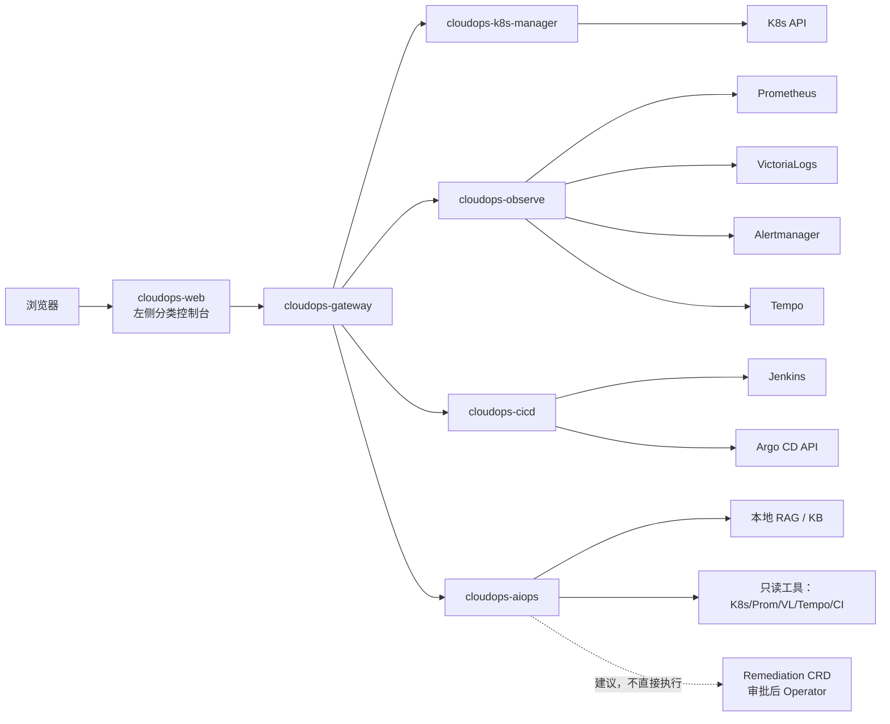
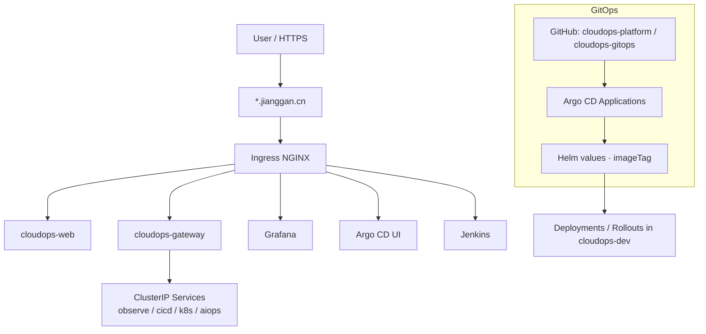
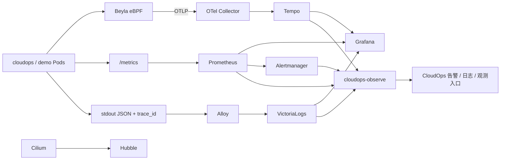
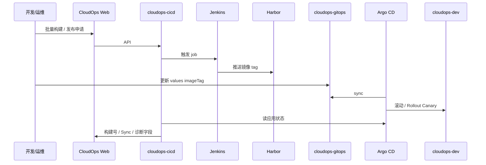
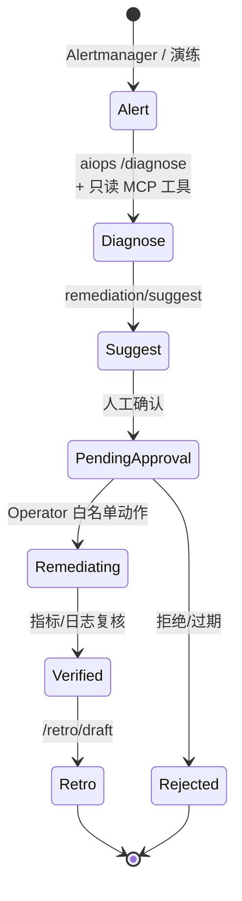
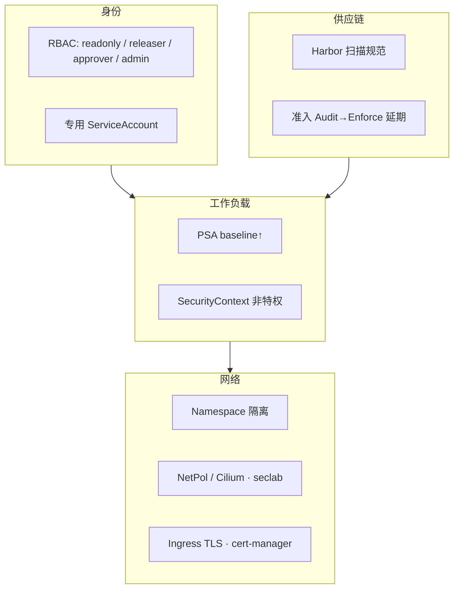

# Day 155 · CloudOps AI 平台架构图集

日期：2026-09-12  
对齐：训练计划第 23 周 Day 155；桌面副本 `专用测试环境/44_第23周_架构图集.md`  
用途：作品集 / 面试白板 / 10 分钟讲解开场

> 图中域名为 lab：`*.jianggan.cn`。延期运行时项（Falco 安装、Chaos live、STRICT mTLS 等）**不画成已上线能力**。

---

## 1. 实验室物理与逻辑拓扑

**一句话**：计算与控制面在 T430/PVE；制品与运维跳板在 `harbor-server`；业务与可观测跑在 K8s。

---

## 2. CloudOps 平台模块图

| 模块 | 职责 |
|------|------|
| web | 可观测 / 交付 / FinOps / AIOps 工作区 |
| gateway | 统一 API 前缀、鉴权占位、路由 |
| k8s-manager | Namespace/Pod/Node/Event 只读查询 |
| observe | 指标、日志、告警、资源浪费、备份任务契约 |
| cicd | Jenkins 构建、Argo 状态、发布申请 |
| aiops | `/ask` `/diagnose` `/tools` `/remediation/suggest` `/retro/draft` |

---

## 3. 北向流量与部署图

**边界（ADR-004）**：基础设施（监控、Harbor、Jenkins）**不进 Istio mesh**；业务/demo 按需注入。N-S 灰度与 Gateway/VS 已具备；真 E-W sidecar 金丝雀见延期清单。

---

## 4. 可观测管道图

主线：**Beyla + 少量 OTel SDK + Collector + Tempo**；日志 **Alloy → VictoriaLogs**（ADR-002/003）。

---

## 5. 发布治理链路图

分工（ADR-006）：Jenkins 构建制品；Harbor 存镜像；Argo CD 声明式发布；CloudOps 做编排入口与状态聚合，不另起 CD。

---

## 6. 智能运维闭环图（半自动）

硬约束：**AI 与工具默认只读**；高风险变更必须审批；无审批自动 execute、破坏性 full-loop drill 延期（`deferred-week15-22`）。

---

## 7. 安全与命名空间边界（示意）

运行时 Falco 安装、Kyverno Enforce、Harbor 自动扫描开关：见 `deferred-week10-security-followups.md`。

---

## 8. 面试 60 秒讲法（开场）

1. Lab：T430 跑 K8s，harbor-server 跑 Harbor/Rancher/跳板。  
2. 平台：Web → Gateway → observe/cicd/k8s/aiops 微服务。  
3. 交付：Jenkins → Harbor → GitOps/Argo（+ Rollouts）。  
4. 可观测：eBPF/Beyla + Prom + VL + Tempo + Hubble，CloudOps 聚合入口。  
5. AIOps：检索与诊断建议，执行必须审批。  

下一页展开任意一张图即可。

---

## 相关索引

| 主题 | 文档 |
|------|------|
| 环境选型 | 桌面 ADR-001 |
| 日志 / OTel / Istio / 安全 | ADR-002–005 |
| CI/CD / Rollouts | ADR-006–007 |
| FinOps / Chaos / RAG / Operator | ADR-008–011 |
| 延期项 | `docs/deferred-week*-followups.md` |
| KB 语料 | `docs/kb/README.md` |
